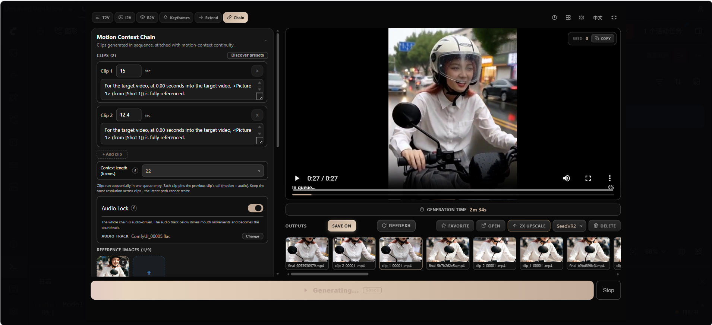
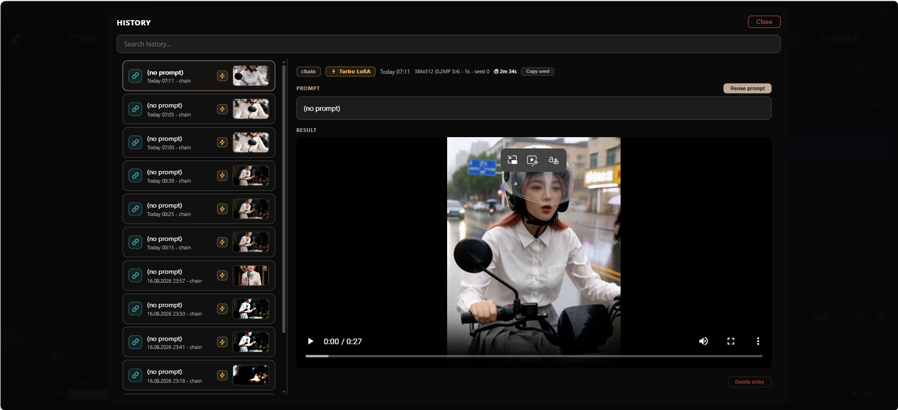
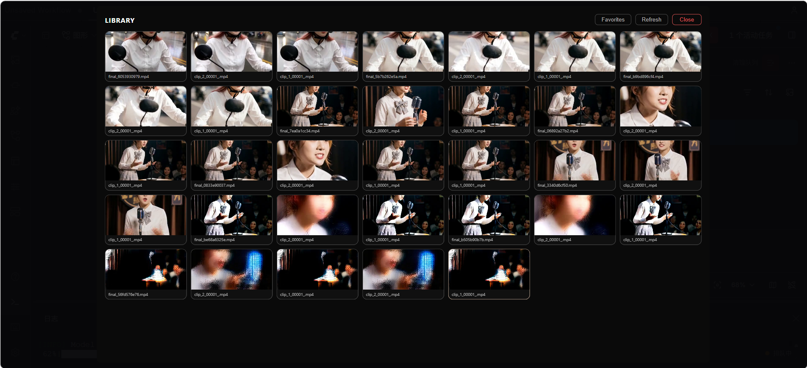
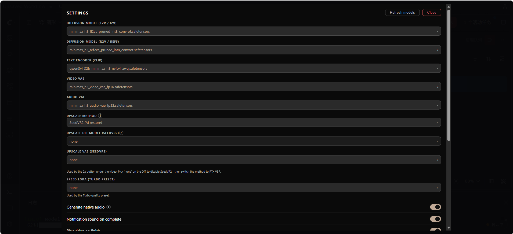

# ComfyUI ALL-in-ONE MiniMax H3


One node. The whole MiniMax H3 video pipeline — including **long videos driven by a single audio track**.

No node graph to build, no wires to connect, no hunting through twelve custom node packs to figure out which workflow is the right one. Pick a mode, drop in your prompt or references, hit **Generate** — the node does the rest.



---

## Chain — long video from one audio track

**Chain** is the star of this node. It generates a sequence of clips with real motion continuity (H3 Motion Context, latent path — no re-encode between clips), then stitches them into one final video automatically.

### Audio Lock

Turn on **Audio Lock** inside Chain and give it one audio track. The node handles everything else:

- Reads the track length and **auto-splits the chain into 15-second-or-less clips** — each boundary snaps to the nearest natural pause (speech silence, or vocal-band gaps for music with no silence), so sentences and sung phrases aren't cut mid-phrase. No clip ever exceeds 15 seconds.
- Every clip drives **lip-sync from its own time-aligned slice** of the track — no more repeating the first 15 seconds on every clip.
- The audio is routed through the Motion Context trim so each clip's soundtrack is the **exact same length as its pictures** — the concatenated result has one continuous, non-repeating soundtrack with **no lip-sync drift**.

### Long video generation

- Any number of clips, each with its own prompt and duration.
- Later clips inherit the previous clip's motion (and audio continuation when Audio Lock is off) through the latent path.
- Clips run in strict order inside one queue entry, and the node **concatenates them with ffmpeg** (stream copy first, re-encode fallback) into a single `final_*.mp4`.
- The video area shows every generated clip plus the final result — click any clip to inspect it.

### References in Chain

Chain also accepts **image / video / audio references** (identity, motion, soundtrack), with the `fl2va` UNet as the default model. Keep the same resolution across all clips — the latent path cannot resize mid-chain.

### Resolution & aspect ratio

- 55 built-in resolution presets from **0.2MP to 1.0MP**, covering landscape, portrait, 3:4, 4:3, 3:2, 2:3, 1:1, 21:9 and 9:21.
- An **aspect-ratio picker** sits in front of the resolution dropdown: pick 16:9, 9:16, etc., and the resolution list filters to matching options.
- Custom sizes snap to multiples of 32 and warn when they leave MiniMax H3's recommended canvas (short edge ≤ 768, long edge ≤ 1344).

## Quick start — Chain + Audio Lock

1. Select **Chain** mode.
2. Turn on **Audio Lock**.
3. Pick your audio track (Select / Change).
4. The clips list is auto-split by the track length (15s per clip).
5. Optionally add image/video references, tune resolution and quality.
6. Hit **Generate** — clips render in order and merge into one final video.

## All modes

| Mode | What it does |
|------|--------------|
| **Chain** | Multi-clip long video with Motion Context continuity, image/video/audio references, and **Audio Lock** for one-track lip-sync |
| **T2V** | Text to video with native audio (fl2va model) |
| **I2V** | Animate a start frame, optionally morph to an end frame |
| **R2V** | Reference images / videos / audio drive the clip (ref2va model) |
| **Keyframes** | Pin still images at arbitrary frame positions |
| **Extend** | Continue an existing video seamlessly |
| **Upscale** | RTX / SeedVR2 video super-resolution hook |

The UI is available in **English** and **中文**, switchable from the toolbar.

## Screenshots

**History** — searchable, with prompt reuse and per-entry preview.



**Library** — every output in one place: inline preview, favorites, open-folder, delete, RTX upscale hook.



**Settings** — theme accent, sounds, models, and the WeChat QR follow area.



## Requirements

### Models

Official MiniMax H3 files from [Comfy-Org/MiniMax-H3](https://huggingface.co/Comfy-Org/MiniMax-H3), placed in your standard `ComfyUI/models/` folders:

| File | Folder |
|------|--------|
| `minimax_h3_fl2va_pruned_int8_convrot.safetensors` | `diffusion_models/` |
| `minimax_h3_ref2va_pruned_int8_convrot.safetensors` | `diffusion_models/` |
| `qwen3vl_32b_minimax_h3_nvfp4_awq.safetensors` | `text_encoders/` |
| `minimax_h3_video_vae_fp16.safetensors` | `vae/` |
| `minimax_h3_audio_vae_fp32.safetensors` | `vae/` |

### Custom nodes

- **Chain / Keyframes / Extend:** [ComfyUI-H3-Motion-Context-MultiRef](https://github.com/seitanism/ComfyUI-H3-Motion-Context-MultiRef) — on ComfyUI 0.32, pin the tested commit `0719855` (current `main` requires ComfyUI PR #15439 / 0.33+). See [COMPATIBILITY.md](COMPATIBILITY.md).
- **Audio Lock / Audio Drive:** comfyui-vrgamedevgirl
- **Turbo preset:** [ComfyUI-MiniMax-H3-Turbo](https://github.com/Larryvrh/ComfyUI-MiniMax-H3-Turbo) + a turbo LoRA from [larryvrh/MiniMax-H3-Turbo-Lora](https://huggingface.co/larryvrh/MiniMax-H3-Turbo-Lora)
- **Optional (Speed / High Quality presets):** ComfyUI-SolAttn_triton, ComfyUI-MiniMaxH3-Cache, SageAttention

Exact tested versions of everything are in **[COMPATIBILITY.md](COMPATIBILITY.md)** — check that file first if something breaks after you update ComfyUI or a pack.

## Installation

```bash
# inside ComfyUI/custom_nodes/
git clone https://github.com/AIFSH/ComfyUI-ALLinONE-MinimaxH3.git
```

Restart ComfyUI, then double-click the canvas and search for **ALL in ONE MiniMaxH3**.

## Compatibility

I develop and test against a pinned stack (ComfyUI version, custom node commits, model files). It's all listed in **[COMPATIBILITY.md](COMPATIBILITY.md)** — if a render fails after you updated something, start there.

> **Important for Chain / Keyframes / Extend:** `ComfyUI-H3-Motion-Context-MultiRef` current `main` dropped the legacy patch path and requires ComfyUI PR #15439 (0.33+). On the pinned ComfyUI 0.32 stack you must stay on commit `0719855`:
>
> ```bash
> cd ComfyUI/custom_nodes/ComfyUI-H3-Motion-Context-MultiRef
> git fetch origin && git checkout 0719855
> ```
>
> then restart ComfyUI (or upgrade ComfyUI to 0.33+ and use the current pack).

## Credits

- The "one node" idea and UI approach: Ján — [one-node-flux-2-klein](https://github.com/yanokusnir-ai/one-node-flux-2-klein) and [one-node-gemma-4](https://github.com/yanokusnir-ai/one-node-gemma-4)
- Chain / Keyframes / Extend wiring: [ComfyUI-H3-Motion-Context-MultiRef](https://github.com/seitanism/ComfyUI-H3-Motion-Context-MultiRef) by seitanism
- Base graphs: the official MiniMax H3 native workflows from Comfy-Org
- Turbo preset: ComfyUI-MiniMax-H3-Turbo pack

## Support

This node is in **beta** — if something breaks, please [open an issue](https://github.com/AIFSH/ComfyUI-ALLinONE-MinimaxH3/issues), it's the fastest way to get it fixed.

**Follow the WeChat official account:** the settings panel shows the QR code directly. Drop your QR image at `web/wechat_qr.png` (or `assets/wechat_qr.png`; `.jpg`/`.jpeg`/`.webp`/`.gif` also work) — it's served through the node's `/h3one/wechat_qr` endpoint, and the format is detected from the file content.

## License

GPL-3.0 — see [LICENSE](LICENSE).
